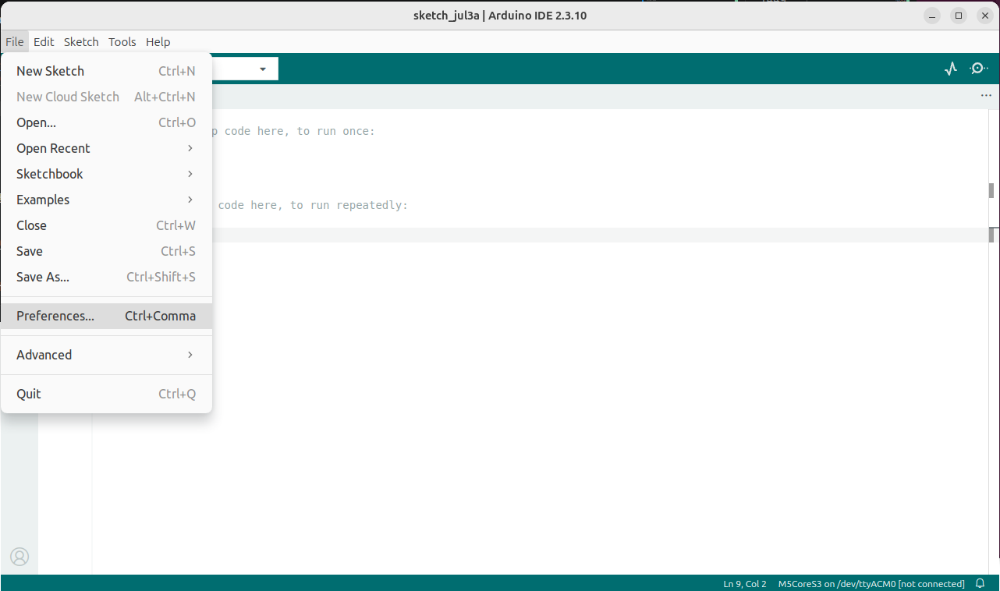
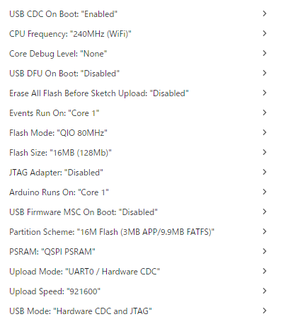

# M5Stack CoreS3 セットアップ手順


M5 CoreS3にプログラムを書き込んで顔を表示させるまでの説明です。

## クイックスタート（3ステップ）

1. **書き込み** — [Web Flasher](https://petitones.github.io/m5-petit-firmware/)をChrome/EdgeでUSB接続して書き込みボタン
2. **スマホから設定** — 画面のQRコードを読み取り、`M5Petit-XXXX`に接続 → 開いたページでWiFi・名前・色を入力して保存
3. **SD送信**（顔画像・効果音、任意） — スマホ/PCのブラウザで`http://<M5のIPかキャラクターID.local>/assets`を開き、ボタンを押すだけ

詳しい手順は下の1〜4を参照。

## 必要なハードウェア・環境

- M5CoreS3
- カメラ付きスマホ（セットアップ用QRコードを読み取るため）
- WiFi環境
- PC（書き込み用）
- microSDカード（FAT32）— **任意**。顔画像・効果音を使いたい場合のみ

## 導入手順

1. ファームウェアを書き込み
2. 初回起動してQRコードでセットアップ
3. SDカード準備(顔画像・効果音。任意)
4. 動作確認

---

### 1. ファームウェアを書き込み

書き込み方法は2通りあります。**初めての方は方法A(ブラウザ)がおすすめです。**

#### 方法A: ブラウザから書き込み（かんたん・推奨）

ChromeまたはEdgeで書き込みページを開き、CoreS3をUSBでつないでボタンを押すだけです。Arduino IDEのインストールは不要です。

**→ [M5 Petit Web Flasher](https://petitones.github.io/m5-petit-firmware/)**

🎬 実際の書き込みの流れは[インストール動画](./videos/install_via_webpage.mp4)を参考にしてください。

書き込みが終わったら手順2(QRコードでセットアップ)へ進んでください。

#### 方法B: Arduino IDEで書き込み（自分でコードをいじりたい人向け）

[Arduino IDE](https://docs.arduino.cc/software/ide/)にアクセスしてDOWNLOAD
ご利用のPCのOS(Windows/Mac/Linux)に合わせてください。

利用確認できているバージョンは**2.3.8**です
https://github.com/arduino/arduino-ide/releases/tag/2.3.8
※2026/7/3最新バージョンは**2.3.10**です

**Linuxの場合（AppImage）：**

ダウンロードした AppImage に実行権限を付けて起動する：

```bash
chmod +x arduino-ide_2.3.10_Linux_64bit.AppImage
./arduino-ide_2.3.10_Linux_64bit.AppImage
```

`The SUID sandbox helper binary was found, but is not configured correctly` というエラーで起動できない場合は `--no-sandbox` を付けて起動する：

```bash
./arduino-ide_2.3.10_Linux_64bit.AppImage --no-sandbox
```

#### 1-1. ボード追加



ファイル > 環境設定 > 追加のボードマネージャURL に追加：

```
https://static-cdn.m5stack.com/resource/arduino/package_m5stack_index.json
```

ツール > ボード > ボードマネージャ → `M5Stack` をインストール

ボード設定：



#### 1-2. ライブラリインストール

CIビルドで動作確認しているバージョン：

- M5CoreS3 (1.0.1)
- M5Unified (0.2.17)
- M5GFX (0.2.24)
- WebSockets by Links2004 (2.4.0)

#### 1-3. 書き込み

`firmware/m5_petit/m5_petit.ino` を Arduino IDE で開き、M5CoreS3 を USB 接続した状態で「マイコンボードに書き込む」を実行。

---

### 2. 初回起動してQRコードでセットアップ

**WiFiパスワードなどの設定は、もうSDカードに平文で置きません。** 書き込み直後の初回起動時に、M5自身が一時的なWiFiアクセスポイントを立て、画面にQRコードを表示します。スマホでQRコードを読み取ってそのAPに接続すると、設定ページが自動で（またはブラウザで`http://192.168.4.1`を開くと）表示されるので、そこでWiFi・名前・色などを入力します。入力内容はSDカードではなく**M5内部のフラッシュメモリ(NVS)**に保存されます。

手順：

1. ファームウェア書き込み後、初めて起動すると画面にQRコードが表示されます（`M5Petit-XXXX`というSSIDと、起動のたびに変わるランダムなパスワードも一緒に表示されます）。
2. スマホのカメラでQRコードを読み取り、案内に従ってWiFi（`M5Petit-XXXX`）に接続します。
3. 接続すると設定ページが自動で開きます（開かない場合はブラウザで`http://192.168.4.1`を開いてください）。
4. 設定ページで以下を入力：
   - WiFi 1（必須）・WiFi 2（任意、この順にフォールバック接続）のSSID・パスワード。外出用ルーターを使う場合はWiFi 1に外出用、WiFi 2に家のWiFiを（家だけなら1だけでOK）
   - キャラクターID（ホスト名にも使用）・表示名
   - 顔の色・背景色
   - サーバーIP（ダッシュボード・音声API、任意）
5. 「保存して再起動」を押すと、M5がWiFiに設定した内容で再起動します。

再設定したいときは、起動直後の画面が出たタイミングで**画面を3秒以上タッチし続ける**と、いつでも同じセットアップ画面に入れます（CoreS3には側面ボタンが無いため、タッチスクリーンの長押しでボタンの代わりをします）。セットアップ画面は10分操作が無いと自動的にタイムアウトして再起動します。

> 🔄 **旧バージョンからのアップグレード:** これまでSDカードの`config.txt`で設定していた場合、初回起動時にその内容を自動的にNVSへ取り込みます（QRセットアップ画面には入りません）。取り込みが終わると画面とシリアルに「SDの`config.txt`は削除推奨」と表示されるので、WiFiパスワードが平文で残っている`config.txt`はSDカードから削除してください。


### 3.SDカード準備

SDカードには**顔画像・効果音などのアセットのみ**を置きます（WiFiパスワードなどの秘密情報は手順2のQRセットアップでNVSに保存されるため、SDカードには一切書き込まれません）。**SDカードが無くても起動・WiFi接続・セットアップは動作します**（表情アニメーションや効果音が鳴らないだけです）。

#### 方法A: ブラウザから送信（一番かんたん・PC不要）

空のSDカード（FAT32）をM5に挿したまま、手順2のセットアップ完了後にスマホ/PCのブラウザで:

```
http://<M5のIPアドレス または キャラクターID.local>/assets
```

「標準アセットを入れる」ボタンを押すだけで、GitHubから標準セット（顔7種・効果音10種）を取得してSDに書き込みます。自分の`.jpg`/`.wav`ファイルを選んで送ることもできます。

送信先IP欄を書き換えれば、**このページを開いたM5以外の別プチ宛て**にも送れます（1台のスマホ/PCから複数台まとめてセットアップするときに便利）。

#### 方法B: PCからスクリプトで送信（WiFi経由）

```bash
python3 tools/push_sd_assets.py <M5のIPアドレス>
# 例: python3 tools/push_sd_assets.py 192.168.1.109
```

自作アセットを送る場合は `--assets ディレクトリ`（face/・wav/を含む）を指定。

#### 方法C: PCからUSBシリアル経由で送信（WiFiが不安定なとき用）

M5をUSBでPCに繋いだまま:

```bash
python3 tools/push_sd_assets_serial.py /dev/ttyACM0
```

WiFiを使わずSDに書き込めます。ただし現状連続送信で時々`ERR timeout`が出ることがあり、方法A/Bより安定性は落ちます（改善予定）。

#### 方法D: SDカードに直接コピー

このリポジトリの[`sd.zip`](./sd.zip)を解凍してSDカード（FAT32）のルートに配置：

```
/
├── face/       ← 顔画像 (.jpg)
└── wav/        ← 効果音 (.wav) ※ 16bit PCM, Mono, 16000Hz
```

WAVが聞こえない場合は Audacity でモノラル変換する。

#### 必須ファイル

以下はコード内でファイル名が固定参照されているため、必ずSDカードに置くこと（それ以外の`face/*.jpg`・`wav/*.wav`はAPI/WSから任意のファイル名で呼び出せるので自由に追加してよい）：

**wav/**
- `zzz.wav` — スリープ時
- `wakeup.wav` — スリープ復帰時
- `success.wav` — 成功音
- `failed.wav` — 失敗音
- `pon.wav` — タッチメニューを閉じたとき

**face/**
- `sleep.jpg` — スリープ中に表示

> 🚧 現在の`sd.zip`には`zzz.wav`・`wakeup.wav`・`sleep.jpg`が含まれていません（近日追加予定）。それまでは同名のWAV（16bit PCM, Mono, 16000Hz）とJPGを自作して置いてください。無い場合、スリープ関連の音と表情だけが動作しません。

---

### 4.動作確認


### IPアドレス確認

起動後30秒間、画面右下（テキストサイズ1）に緑色でIPアドレスが表示される。シリアルモニタ（115200baud）でも確認可能。

mDNS対応のため、IPアドレスの代わりにホスト名でもアクセス可能：

- `http://<キャラクターID>.local/`（例：QRセットアップで入力したキャラクターIDが`puchi`なら `http://puchi.local/`）

> ホスト名はQRセットアップで入力した「キャラクターID」がそのまま使われます。WebSocketも `ws://<キャラクターID>.local:8080` で接続可能。

---


## API仕様
### HTTP API

| エンドポイント | 説明 |
|---|---|
| `GET /help` | API一覧 |
| `GET /snapshot` | カメラ撮影（JPEG） |
| `GET /face_list` | 顔画像ファイル一覧（JSON） |
| `GET /face_play?name=xxx.jpg` | 顔画像を5秒表示 |
| `GET /face_draw_mode` | 描画モードへ切替 |
| `GET /face_play_mode` | スライドショーモードへ切替 |
| `GET /set_face_draw?eyeX=&eyeY=&mouth=` | 視線・口の制御（5秒後に戻る） |
| `GET /blink?left=true&right=false` | ウィンク |
| `GET /se_list` | 効果音ファイル一覧（JSON） |
| `GET /se_play?name=xxx.wav` | 効果音再生 |
| `GET /setvolume?value=0~100` | 音量変更 |
| `GET /getvolume` | 現在の音量取得（0〜100） |
| `GET /icon_list` | アイコン一覧 |
| `GET /icon_play?name=love\|cry` | アイコン表示（3秒） |
| `GET /set_color?color=RRGGBB` | 顔の色変更 |
| `GET /status` | 状態取得（is_sleeping, power_save） |
| `GET /setbrightness?value=0~100` | 画面輝度変更 |
| `GET /getbrightness` | 画面輝度取得 |
| `GET /sensors` | センサーデータ取得（IMU/照度/近接/バッテリー/RSSI） |
| `GET /powersave?value=true\|false` | 省電力モード切替（輝度制限+描画10fps） |
| `GET /getpowersave` | 省電力モード状態取得 |
| `GET /sleep` | スリープモード |
| `GET /wake` | スリープから復帰 |
| `POST /upload_wav` | WAVファイルをSDにアップロード（multipart/form-data、CORS許可） |
| `POST /upload_face` | 顔画像(JPG)をSDにアップロード（multipart/form-data、CORS許可） |
| `GET /assets` | ブラウザ用SDアセット導入ページ（送信先IP指定可） |

---

### WebSocket API

接続先：`ws://<IPアドレス>:8080`

### クライアント → M5（コマンド）

テキストメッセージで送信。

| コマンド | 説明 |
|---|---|
| `LOOK x y` | 視線移動。x/y: -100〜100。5秒後に正面へ戻る |
| `LOOK x y mouth` | 視線＋口の開き（mouth: 0〜100） |
| `BLINK l r` | ウィンク。l/r: 0か1。0.8秒後に戻る |
| `MODE draw` | 描画モード（目・口をリアルタイム描画） |
| `MODE jpeg` | スライドショーモード（SDのJPEGを3秒ごとに表示） |
| `PLAY filename.wav` | WAVファイルを再生 |
| `VOL value` | 音量設定（0〜100） |
| `ICON love` | ハートアイコンを3秒表示 |
| `ICON cry` | 涙アイコンを3秒表示 |
| `MIC_START` | マイクをオンにして音声ストリーム開始 |
| `MIC_STOP` | マイクをオフ |
| `COLOR RRGGBB` | 顔の色変更 |
| `BRIGHTNESS value` | 画面輝度設定（0〜100） |
| `POWERSAVE ON` | 省電力モードON |
| `POWERSAVE OFF` | 省電力モードOFF |
| `SLEEP` | スリープモード（3回タッチで復帰） |
| `WAKE` | スリープから復帰 |

音声を送る場合は PCM バイナリ（int16, Mono, 16000Hz）を送り、最後に `END` を送る。

### M5 → クライアント（イベント）

#### センサーデータ（250ms周期）

```json
{
  "event": "sensors",
  "ambient": 342,
  "proximity": 120,
  "ax": 0.01, "ay": -0.98, "az": 0.12,
  "gx": 0.00, "gy": 0.02, "gz": -0.01,
  "battery": 83.4,
  "voltage": 3.982,
  "rssi": -45
}
```

#### タッチイベント

```json
{
  "event": "touch",
  "x": 120,
  "y": 200
}
```

#### マイク音声（MIC_START後）

バイナリ（int16, Mono, 16000Hz, 約30ms毎）

#### 録音終了イベント

無音タイムアウト（5秒）または最大録音時間（30秒）に達したとき、マイクを停止して送信：

```json
{ "event": "mic_end" }
```

---

### 省電力モード

`/powersave?value=true` またはWSで `POWERSAVE ON` で有効化。

- 画面輝度を40以下に制限
- 顔の描画を30fps→10fpsに削減
- バッテリー持ち改善（おでかけ時に推奨）

### 低バッテリー自動スリープ

バッテリー残量が10%以下になると自動的にスリープモードに入る。完全放電を防止。

> バッテリー0%は充電中を意味するため、自動スリープの対象外。

### ファイルアップロード

SDカードを抜き差しせずにHTTPでファイルを追加できる。

```bash
# WAVファイルをアップロード
curl -F "file=@hello.wav" http://<IP>/upload_wav

# 顔画像をアップロード
curl -F "file=@smile.jpg" http://<IP>/upload_face
```

### タッチ反応

タッチすると脊髄反射で目をつぶる（まばたき）。タッチイベントはWSでも配信される。

### タッチメニュー

- **タップ**: メニューオーバーレイを表示（5秒で自動消去）
- **スワイプ/長押し後離す**: メニューを閉じる（pon.wav が鳴る）

メニューは画面を4分割した2×2グリッド：

| 左上: CAM | 右上: SEN |
|---|---|
| 左下: MIC | 右下: SET |

- **CAM / SEN** を選択すると `{"event":"menu_select","item":"camera"|"sensor"}` をWSに送信
- **SET** を選択すると設定画面に遷移

#### MIC ボタン（2モード）

| 操作 | 動作 |
|------|------|
| **短タップ** | 1回だけ録音（`mic_end` 送信後に停止） |
| **長押し（600ms以上）** | 往復モード：返答音声が終わると次の録音を自動開始 |

録音中に**顔画面をタップ**すると、どちらのモードでも停止（往復も終了）。

### 設定画面（SET）

| エリア | 操作 | 機能 |
|---|---|---|
| BRIGHTNESS | 左タップ: 下げる / 右タップ: 上げる | 画面輝度（5段階: 100/75/50/5/0%） |
| VOLUME | 左タップ: 下げる / 右タップ: 上げる | 音量（5段階: 100/75/50/25/0%） |
| PSAVE | タップ | 省電力モードON/OFFトグル |
| CAM TO | タップ | みてみて・きいて・かんじてのメール送信先を順番に切り替え |
| `< BACK` | タップ | 設定画面を閉じる |

CAM TO の順番とデフォルト値は `config.h` で設定する（後述）。

### ステータス表示

録音・撮影・センサー送信中は画面右上に状態テキストが表示される：

| 表示 | 意味 |
|------|------|
| `CAM` | スナップショット取得中 |
| `MIC` | マイク録音中（目が左右にゆれる） |
| `MIC LOOP` | 往復モード録音中 |
| `LOOP` | 往復モード待機中（次の録音を待っている） |
| `SEN` | センサーデータ送信（3秒表示） |

WiFi接続エラー時は `WiFi ERROR` が優先表示される。

往復モード（`LOOP`）は待機中に画面右下に `tap:cancel` も表示される。待機中にタップすると往復モードを解除できる。

### マイク録音の停止条件

以下のいずれかで自動停止し `mic_end` イベントを送信：

- **無音5秒**（`SILENCE_TIMEOUT_MS`）: 最後に音を検知してから5秒経過
- **最大30秒**（`MIC_MAX_DURATION_MS`）: うるさい環境でも必ず終了
- **顔タップ**: 録音中に顔画面をタップすると即停止（往復モードも解除）

録音中は目が sin 波で左右にゆれ、停止時に正面に戻る。


### 注意事項

- **マイクとスピーカーは同時使用不可**（I2S/DMA競合）。再生中はマイク停止、録音中はスピーカー停止。
- **マイクは接続時に自動起動しない**。`MIC_START` コマンドまたはメニューから明示的に起動すること。
- **往復モード中にWSが切断**されると、ループは自動解除される。

---

### ネットワーク構成

#### WiFiフォールバック

M5 は起動時（＋切断時の再接続）に、QRセットアップで登録した順に WiFi 接続を試みる：

| 優先度 | SSID | IP割り当て | 用途(例) |
|---|---|---|---|
| 1 | WiFi 1 | DHCP または固定IP（枠ごとに設定可） | GL.iNET MT3000等の外出用ルーター（家だけなら自宅WiFi） |
| 2 | WiFi 2（任意） | DHCP または固定IP（枠ごとに設定可） | 自宅WiFi |

すべて失敗した場合は 1 秒ごとに WiFi 1→2 の順で再試行し続ける。QRセットアップ画面のWiFi枠ごとに固定IP欄（任意、空欄=DHCP）があり、ネットワークごとに異なるIPを割り当てられる（例: WiFi1=192.168.8.12、WiFi2=192.168.1.109）。ゲートウェイ/DNSはIPの先頭3オクテット+`.1`・サブネット`/24`を自動で仮定する。ルーター側でDHCP予約する運用でも問題ない。

#### 外出時の接続構成（MT3000 + Tailscale の例）

```
[外出先]
スマホ（テザリング）
    └─ WAN → [GL.iNET MT3000]
                  └─ LAN（192.168.8.0/24）
                        ├─ M5（192.168.8.x, DHCP）
                        └─ （他のデバイス）

[家のPC]
    └─ Tailscale ──────────── MT3000（Tailscale ノード）
                              ↓ サブネットルート 192.168.8.0/24
                              M5 に直接アクセス可能
```

- M5 は MT3000 のWiFiに接続し、192.168.8.x のIPをDHCPで取得（MT3000側でDHCP予約すれば実質固定化できる）。
- PC は Tailscale で MT3000 に接続し、192.168.8.x 宛のパケットを MT3000 経由でルーティング。
- ポートフォワードは不要（Tailscale が NAT 越えを処理）。

#### セキュリティ

| 項目 | 対策 |
|---|---|
| WiFiパスワード・NVS設定 | QRセットアップ経由でM5内蔵フラッシュ(NVS)に保存。SDカードには一切書き込まれない |
| 旧SD `config.txt` | 初回起動時にNVSへ自動移行し、画面・シリアルで削除を促す（平文パスワードが残っているため） |
| セットアップ用SoftAP | パスワードは起動ごとにランダム生成（8文字以上）、10分でタイムアウトして再起動 |
| Tailscale | ed25519 ベースの相互認証。管理コンソールで承認したデバイスのみ参加可 |
| M5 HTTP API | 認証なし。Tailscale ネットワーク内のデバイスのみアクセス可（インターネット非公開） |
| MT3000 管理画面 | 強いパスワードを設定すること |

**リスクの整理：**
- M5 は認証なしの HTTP サーバー。Tailscale ネットワーク参加者は誰でも操作できる。
- Tailscale アカウントが乗っ取られると M5 への不正アクセスが可能になる → 2FA を有効化すること。

---

### テスト用HTML

`test.html` をブラウザで開くと、WS接続・マイク音声受信・WAV送信をブラウザから試せる。

